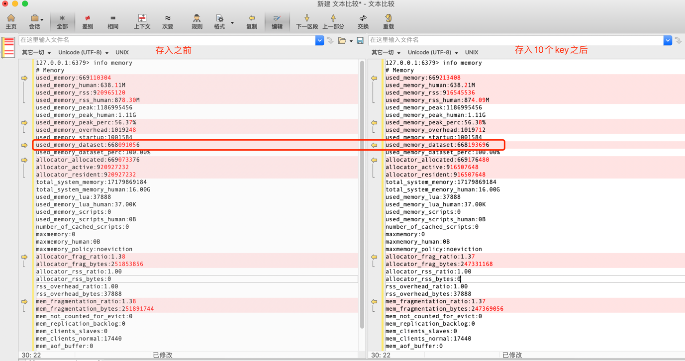
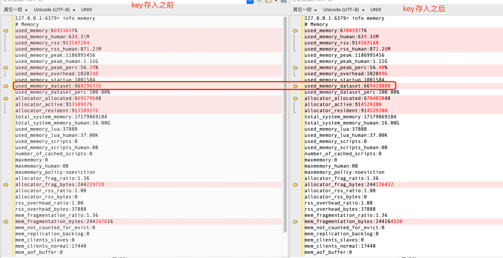

## 1、使用 redis benchmark 工具, 测试 10 20 50 100 200 1k 5k 字节 value 大小，redis get set 性能。
### 1.1 10字节
```
dz0400819@MacBook-Pro   redis-benchmark -h 127.0.0.1 -p 6379 -q -d 10
PING_INLINE: 121212.12 requests per second
PING_BULK: 123609.39 requests per second
17067:M 20 Jun 2021 12:24:24.786 * 10000 changes in 60 seconds. Saving...
17067:M 20 Jun 2021 12:24:24.786 * Background saving started by pid 17163
17163:C 20 Jun 2021 12:24:24.787 * DB saved on disk
17067:M 20 Jun 2021 12:24:24.886 * Background saving terminated with success
SET: 121212.12 requests per second
GET: 123001.23 requests per second
INCR: 121951.22 requests per second
LPUSH: 123762.38 requests per second
RPUSH: 125313.29 requests per second
LPOP: 120918.98 requests per second
RPOP: 125156.45 requests per second
SADD: 125944.58 requests per second
HSET: 123762.38 requests per second
SPOP: 123609.39 requests per second
ZADD: 121802.68 requests per second
ZPOPMIN: 126582.27 requests per second
LPUSH (needed to benchmark LRANGE): 125470.52 requests per second
LRANGE_100 (first 100 elements): 30012.00 requests per second
LRANGE_300 (first 300 elements): 12156.58 requests per second
LRANGE_500 (first 450 elements): 8306.34 requests per second
LRANGE_600 (first 600 elements): 6207.71 requests per second
MSET (10 keys): 96805.42 requests per second
```

### 1.2 20字节
```
 ⚙ dz0400819@MacBook-Pro  ~  redis-benchmark -h 127.0.0.1 -p 6379 -q -d 20
PING_INLINE: 121951.22 requests per second
PING_BULK: 119474.31 requests per second
17067:M 20 Jun 2021 12:32:07.996 * 100 changes in 300 seconds. Saving...
17067:M 20 Jun 2021 12:32:07.996 * Background saving started by pid 17788
17788:C 20 Jun 2021 12:32:08.000 * DB saved on disk
17067:M 20 Jun 2021 12:32:08.096 * Background saving terminated with success
SET: 117370.89 requests per second
GET: 118203.30 requests per second
INCR: 123915.74 requests per second
LPUSH: 122100.12 requests per second
RPUSH: 122100.12 requests per second
LPOP: 120048.02 requests per second
RPOP: 118906.06 requests per second
SADD: 120336.95 requests per second
HSET: 123915.74 requests per second
SPOP: 122850.12 requests per second
ZADD: 121212.12 requests per second
ZPOPMIN: 120481.93 requests per second
LPUSH (needed to benchmark LRANGE): 87336.24 requests per second
LRANGE_100 (first 100 elements): 27329.87 requests per second
LRANGE_300 (first 300 elements): 11213.28 requests per second
LRANGE_500 (first 450 elements): 7953.55 requests per second
LRANGE_600 (first 600 elements): 6193.87 requests per second
MSET (10 keys): 92421.44 requests per second
```
### 1.3 50字节
```
⚙ dz0400819@MacBook-Pro  ~  redis-benchmark -h 127.0.0.1 -p 6379 -q -d 50
PING_INLINE: 120772.95 requests per second
PING_BULK: 123762.38 requests per second
17067:M 20 Jun 2021 12:34:33.978 * 10000 changes in 60 seconds. Saving...
17067:M 20 Jun 2021 12:34:33.978 * Background saving started by pid 17891
17891:C 20 Jun 2021 12:34:33.988 * DB saved on disk
17067:M 20 Jun 2021 12:34:34.078 * Background saving terminated with success
SET: 114810.56 requests per second
GET: 122549.02 requests per second
INCR: 125786.16 requests per second
LPUSH: 122100.12 requests per second
RPUSH: 123001.23 requests per second
LPOP: 120918.98 requests per second
RPOP: 122699.39 requests per second
SADD: 122549.02 requests per second
HSET: 121802.68 requests per second
SPOP: 124223.60 requests per second
ZADD: 120918.98 requests per second
ZPOPMIN: 112612.61 requests per second
LPUSH (needed to benchmark LRANGE): 98911.96 requests per second
LRANGE_100 (first 100 elements): 28818.44 requests per second
LRANGE_300 (first 300 elements): 10899.18 requests per second
LRANGE_500 (first 450 elements): 7403.02 requests per second
LRANGE_600 (first 600 elements): 5183.23 requests per second
MSET (10 keys): 85470.09 requests per second
```

### 1.4 50字节
```
⚙ dz0400819@MacBook-Pro  ~  redis-benchmark -h 127.0.0.1 -p 6379 -q -d 50
PING_INLINE: 120772.95 requests per second
PING_BULK: 123762.38 requests per second
17067:M 20 Jun 2021 12:34:33.978 * 10000 changes in 60 seconds. Saving...
17067:M 20 Jun 2021 12:34:33.978 * Background saving started by pid 17891
17891:C 20 Jun 2021 12:34:33.988 * DB saved on disk
17067:M 20 Jun 2021 12:34:34.078 * Background saving terminated with success
SET: 114810.56 requests per second
GET: 122549.02 requests per second
INCR: 125786.16 requests per second
LPUSH: 122100.12 requests per second
RPUSH: 123001.23 requests per second
LPOP: 120918.98 requests per second
RPOP: 122699.39 requests per second
SADD: 122549.02 requests per second
HSET: 121802.68 requests per second
SPOP: 124223.60 requests per second
ZADD: 120918.98 requests per second
ZPOPMIN: 112612.61 requests per second
LPUSH (needed to benchmark LRANGE): 98911.96 requests per second
LRANGE_100 (first 100 elements): 28818.44 requests per second
LRANGE_300 (first 300 elements): 10899.18 requests per second
LRANGE_500 (first 450 elements): 7403.02 requests per second
LRANGE_600 (first 600 elements): 5183.23 requests per second
MSET (10 keys): 85470.09 requests per second
```
### 1.5 100字节
```
⚙ dz0400819@MacBook-Pro  ~  redis-benchmark -h 127.0.0.1 -p 6379 -q -d 100
PING_INLINE: 123001.23 requests per second
PING_BULK: 122699.39 requests per second
SET: 115207.38 requests per second
GET: 118483.41 requests per second
17067:M 20 Jun 2021 12:36:36.042 * 10000 changes in 60 seconds. Saving...
17067:M 20 Jun 2021 12:36:36.042 * Background saving started by pid 17938
17938:C 20 Jun 2021 12:36:36.060 * DB saved on disk
17067:M 20 Jun 2021 12:36:36.142 * Background saving terminated with success
INCR: 109289.62 requests per second
LPUSH: 116009.28 requests per second
RPUSH: 110375.27 requests per second
LPOP: 101522.84 requests per second
RPOP: 116959.06 requests per second
SADD: 122699.39 requests per second
HSET: 107181.13 requests per second
SPOP: 112612.61 requests per second
ZADD: 125000.00 requests per second
ZPOPMIN: 124378.11 requests per second
LPUSH (needed to benchmark LRANGE): 122850.12 requests per second
LRANGE_100 (first 100 elements): 29351.33 requests per second
LRANGE_300 (first 300 elements): 10598.83 requests per second
LRANGE_500 (first 450 elements): 6360.51 requests per second
LRANGE_600 (first 600 elements): 4908.46 requests per second
MSET (10 keys): 83752.09 requests per second
```

### 1.6 200字节
```
⚙ dz0400819@MacBook-Pro  ~  redis-benchmark -h 127.0.0.1 -p 6379 -q -d 200
PING_INLINE: 122399.02 requests per second
PING_BULK: 124688.28 requests per second
SET: 114810.56 requests per second
GET: 104275.29 requests per second
INCR: 121212.12 requests per second
LPUSH: 116686.12 requests per second
RPUSH: 117785.63 requests per second
LPOP: 99403.58 requests per second
RPOP: 101522.84 requests per second
SADD: 98425.20 requests per second
HSET: 115074.80 requests per second
SPOP: 122399.02 requests per second
ZADD: 118623.96 requests per second
ZPOPMIN: 114155.25 requests per second
LPUSH (needed to benchmark LRANGE): 96993.21 requests per second
LRANGE_100 (first 100 elements): 23940.63 requests per second
LRANGE_300 (first 300 elements): 7773.63 requests per second
17067:M 20 Jun 2021 12:41:24.076 * 10000 changes in 60 seconds. Saving...
17067:M 20 Jun 2021 12:41:24.077 * Background saving started by pid 18027
18027:C 20 Jun 2021 12:41:24.169 * DB saved on disk
17067:M 20 Jun 2021 12:41:24.178 * Background saving terminated with success
LRANGE_500 (first 450 elements): 5457.03 requests per second
LRANGE_600 (first 600 elements): 3961.34 requests per second
MSET (10 keys): 80840.74 requests per second
```

### 1.7 1000字节
```
 ⚙ dz0400819@MacBook-Pro  ~  redis-benchmark -h 127.0.0.1 -p 6379 -q -d 1000
PING_INLINE: 121654.50 requests per second
PING_BULK: 125156.45 requests per second
SET: 119760.48 requests per second
GET: 109289.62 requests per second
17067:M 20 Jun 2021 12:42:25.082 * 10000 changes in 60 seconds. Saving...
17067:M 20 Jun 2021 12:42:25.083 * Background saving started by pid 18061
18061:C 20 Jun 2021 12:42:25.169 * DB saved on disk
17067:M 20 Jun 2021 12:42:25.183 * Background saving terminated with success
INCR: 116414.43 requests per second
LPUSH: 100908.17 requests per second
RPUSH: 98716.68 requests per second
LPOP: 119331.74 requests per second
RPOP: 98425.20 requests per second
SADD: 117233.30 requests per second
HSET: 113636.37 requests per second
SPOP: 122249.38 requests per second
ZADD: 114416.48 requests per second
ZPOPMIN: 115874.86 requests per second
LPUSH (needed to benchmark LRANGE): 117785.63 requests per second
LRANGE_100 (first 100 elements): 11249.86 requests per second
LRANGE_300 (first 300 elements): 3166.46 requests per second
17067:M 20 Jun 2021 12:43:26.025 * 10000 changes in 60 seconds. Saving...
17067:M 20 Jun 2021 12:43:26.027 * Background saving started by pid 18074
18074:C 20 Jun 2021 12:43:26.378 * DB saved on disk
17067:M 20 Jun 2021 12:43:26.427 * Background saving terminated with success
LRANGE_500 (first 450 elements): 2371.24 requests per second
LRANGE_600 (first 600 elements): 1678.30 requests per second
17067:M 20 Jun 2021 12:44:56.575 * 10000 changes in 60 seconds. Saving...
17067:M 20 Jun 2021 12:44:56.576 * Background saving started by pid 18087
18087:C 20 Jun 2021 12:44:56.913 * DB saved on disk
17067:M 20 Jun 2021 12:44:56.976 * Background saving terminated with success
MSET (10 keys): 77821.02 requests per second
```
### 1.8 5000字节
```
 ⚙ dz0400819@MacBook-Pro  ~  redis-benchmark -h 127.0.0.1 -p 6379 -q -d 5000
PING_INLINE: 117647.05 requests per second
PING_BULK: 115740.73 requests per second
SET: 112233.45 requests per second
GET: 111856.82 requests per second
INCR: 114285.71 requests per second
LPUSH: 100502.52 requests per second
RPUSH: 85984.52 requests per second
LPOP: 101419.88 requests per second
RPOP: 97370.98 requests per second
SADD: 121065.38 requests per second
HSET: 94428.70 requests per second
SPOP: 104166.67 requests per second
ZADD: 102040.81 requests per second
ZPOPMIN: 121212.12 requests per second
LPUSH (needed to benchmark LRANGE): 90171.33 requests per second
17067:M 20 Jun 2021 12:45:57.009 * 10000 changes in 60 seconds. Saving...
17067:M 20 Jun 2021 12:45:57.014 * Background saving started by pid 18104
18104:C 20 Jun 2021 12:46:02.802 * DB saved on disk
17067:M 20 Jun 2021 12:46:02.922 * Background saving terminated with success
LRANGE_100 (first 100 elements): 3150.60 requests per second
LRANGE_300 (first 300 elements): 1057.71 requests per second
LRANGE_500 (first 450 elements): 672.09 requests per second
LRANGE_600 (first 600 elements): 481.43 requests per second
17067:M 20 Jun 2021 12:53:52.435 * 100 changes in 300 seconds. Saving...
17067:M 20 Jun 2021 12:53:52.437 * Background saving started by pid 18212
MSET (10 keys): 27277.69 requests per second
```
## 2、写入一定量的 kv 数据, 根据数据大小 1w-50w 自己评估, 结合写入前后的 info memory 信息  , 分析上述不同 value 大小下，平均每个 key 的占用内存空间。
### 2.1写入10个key, 每个key的value大小为1w字节
```go
package main

import (
	"fmt"
	"github.com/garyburd/redigo/redis"
)

func main()  {
	value1 := make([]byte,10000)

	c, err := redis.Dial("tcp", "127.0.0.1:6379")
	if err != nil {
		fmt.Println("Connect to redis error", err)
		return
	}
	defer c.Close()
	for _,num:= range []int{1,2,3,4,5,6,7,8,9,10}{
		key := fmt.Sprintf("var_%d",num)
		_, err = c.Do("SET", key, string(value1))
		if err != nil {
			fmt.Println("redis set failed:", err)
		}
	}

	
}

```
```
127.0.0.1:6379> keys *
 1) "var_7"
 2) "key:__rand_int__"
 3) "var_10"
 4) "mylist"
 5) "myhash"
 6) "var_3"
 7) "var_1"
 8) "var_4"
 9) "counter:__rand_int__"
10) "var_9"
11) "var_5"
12) "var_8"
13) "var_6"
14) "var_2"
```


每个key占用内存大小=（668193696-668091056）/10=10264(字节)

### 2.2写入10个key, 每个key的value大小为10w字节
```go
package main

import (
	"fmt"
	"github.com/garyburd/redigo/redis"
)

func main()  {
	value1 := make([]byte,100000)

	c, err := redis.Dial("tcp", "127.0.0.1:6379")
	if err != nil {
		fmt.Println("Connect to redis error", err)
		return
	}
	defer c.Close()
	for _,num:= range []int{1,2,3,4,5,6,7,8,9,10}{
		key := fmt.Sprintf("var10_%d",num)
		_, err = c.Do("SET", key, string(value1))
		if err != nil {
			fmt.Println("redis set failed:", err)
		}
	}

	
}

```


每个key占用内存大小=（6669418880-6668296336）/10=112254.4(字节)

